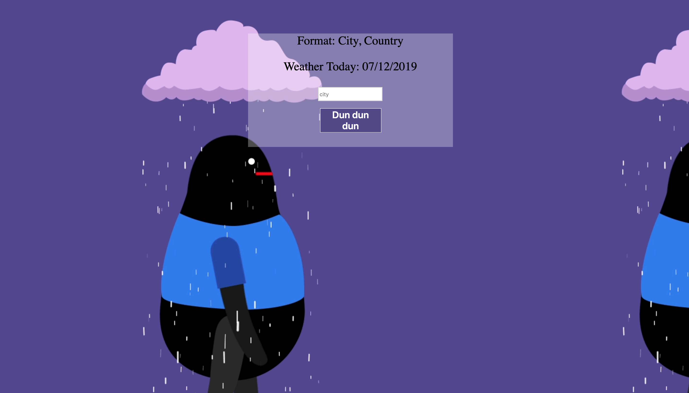

# 🌦 Project: Weather API

### Goal: Enable your user to enter a city + country and return the temperature in Fahrenheit

### Preview:



### lessons learned:
```
In this Project I learned how to call an end point using a API with template literals that contain the value of the users input. This will be very useful in the future.

```
